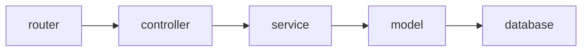

# 基于 Go 语言的博客Restful Api

本项目预计作为我的博客的后端，预计实现以下功能
- 内容管理，提供文章及其相关操作的接口
- 用户管理，同时实现 Google, GitHub, Microsoft 等常见的 OAuth 登录能力
- 评论功能，支持 Markdown
- 基于标签的交叉搜索
- 支持 Obsidian 导入
- 静态资源管理

开发本项目的一个重要目的是锻炼我的Go语言能力。希望我的代码可以对同我一样初学Go语言的同学有启发意义。同时，也希望大家对我拙劣的代码能力不吝赐教。

## 项目结构

本项目由 [Gin](https://github.com/gin-gonic/gin), [Gorm](https://gorm.io), [Viper](https://github.com/spf13/viper) 驱动，使用 [migrate](https://github.com/golang-migrate/migrate) 进行数据库迁移。

- `cmd/` 该目录下为一些命令行帮助小程序 
  - `secret` 生成 secret，并存于 config 文件
- `conf/` 配置文件目录
- `controllers/` 该目录为控制器目录
- `database/` 数据库迁移相关
- `models/` 模型文件
- `pkg/`
    - `config` 配置文件解析
    - `db` 数据库连接
    - `password` 用户密码相关的一些处理
    - `secret` 密钥相关处理
- `routers/` 路由
- `services` 服务
